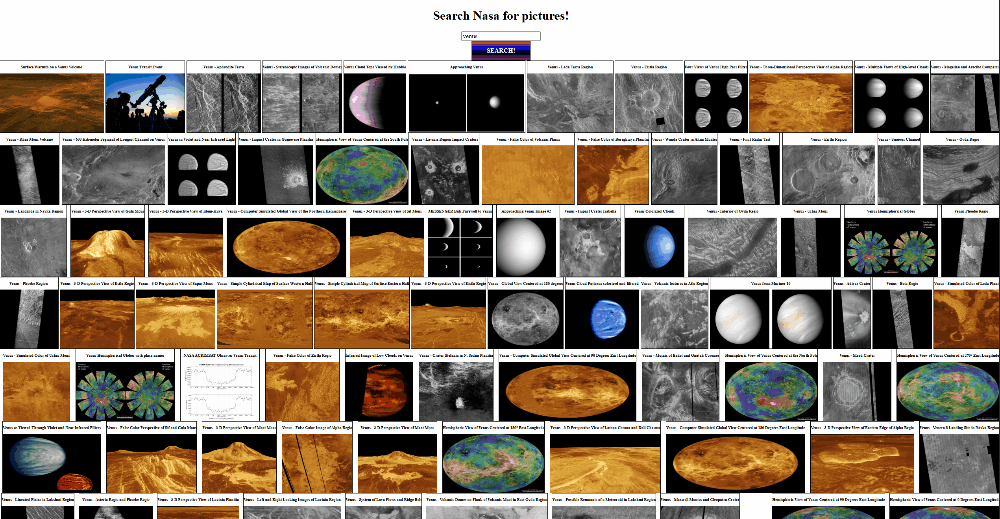

# This is a work in progress

# NASA API Search Tool 🚀  
A lightweight front-end application that lets users search and view images from NASA's public API based on keyword input.
 
---

## ⚙️ Features
- User-driven search for space images using NASA's open API
- Dynamically loads image results with associated titles
- Basic error handling for null results or failed fetches
- Built with plain HTML, CSS, and JavaScript

---

## 🔗 API Used
[NASA Image and Video Library API](https://images.nasa.gov/docs/images.nasa.gov_api_docs.pdf)  
Searches are powered by public data provided by NASA’s image archive.

---

## 🛠 Technologies Used
- HTML5
- CSS3
- JavaScript (Vanilla)
- NASA Image API (REST)

---

## 📝 Usage
Type a keyword into the search bar and press enter or click search. Relevant images will populate with titles in a responsive gallery layout.

---

## 🔒 Notice
This project was created for educational and demonstration purposes using public NASA API data. It is not affiliated with or endorsed by NASA.
